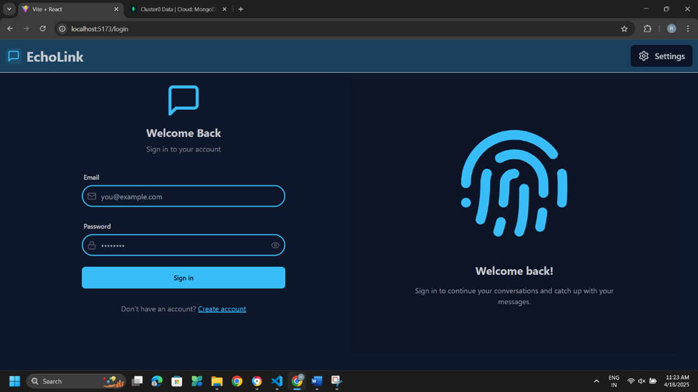
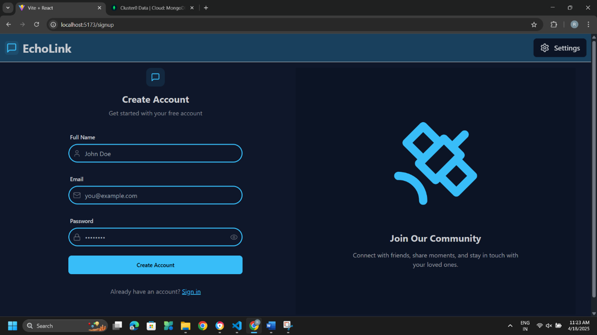
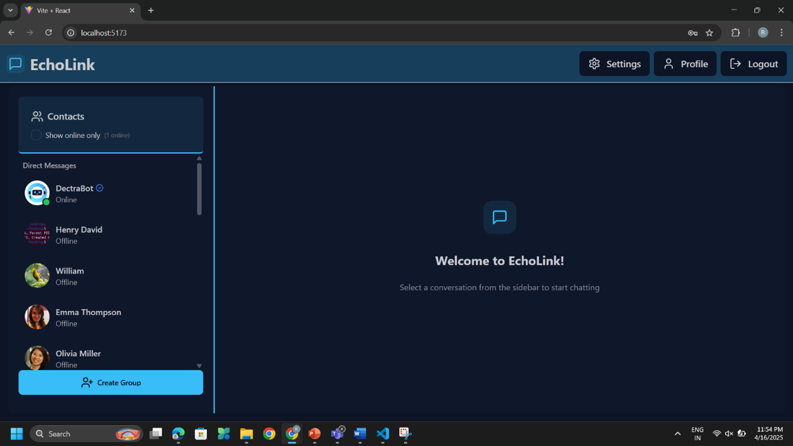
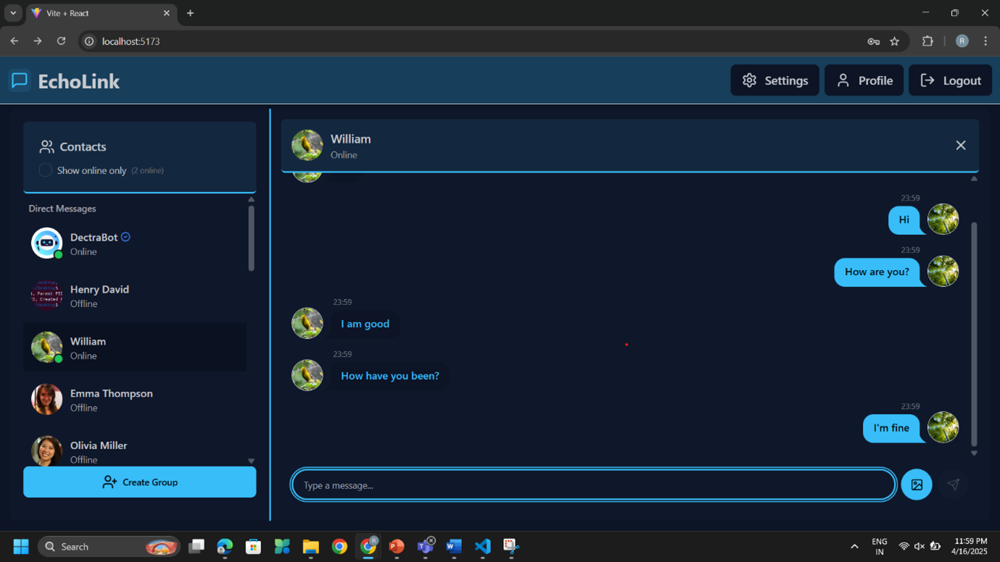
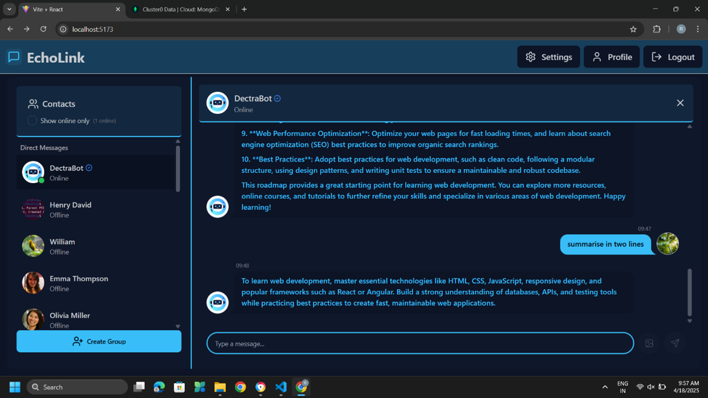
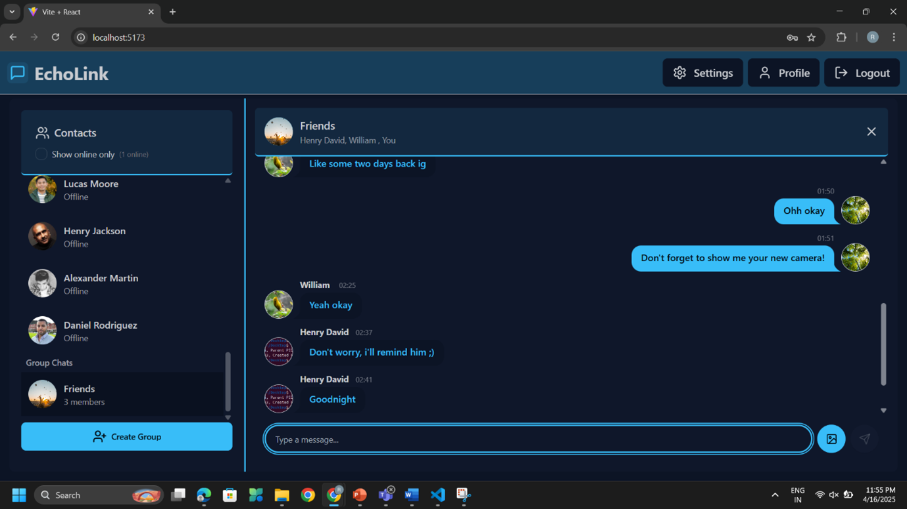
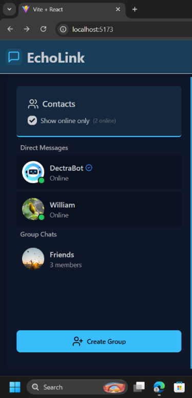
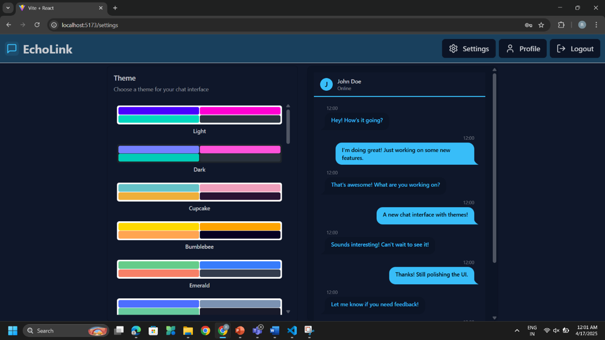
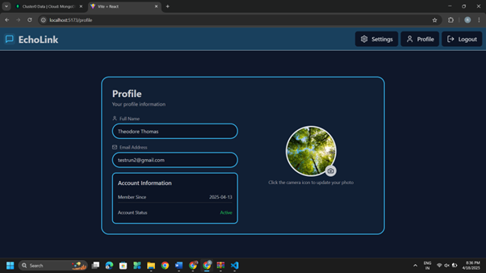

# EchoLink

EchoLink is a full-stack real-time chat application with:

- **1:1 messaging** (text + image support)
- **Group chats** with live updates via Socket.IO
- **Authentication** using JWT in secure HTTP-only cookies
- **Profile image uploads** through Cloudinary
- **AI assistant chat** via a built-in bot user (`dectrabot@ai.com`) that calls OpenRouter
- **Theme switching** on the frontend (DaisyUI/Tailwind)

The project is split into:

- `frontend/` → React + Vite + Zustand + Tailwind/DaisyUI
- `backend/` → Express + MongoDB (Mongoose) + Socket.IO

<p align="center">
  
</p>
<p align="center">
  
</p>
<p align="center">
  
</p>
<p align="center">
  
</p>
<p align="center">
  
</p>
<p align="center">
  
</p>
<p align="center">
  
</p>
<p align="center">
  
</p>
<p align="center">
  
</p>


## Tech Stack

### Frontend
- React 19
- Vite 6
- Zustand for app state
- React Router
- Socket.IO client
- Tailwind CSS + DaisyUI
- Axios

### Backend
- Node.js + Express
- MongoDB + Mongoose
- Socket.IO
- JWT + cookie-based auth
- Cloudinary for media uploads
- OpenRouter API (Mistral model) for bot replies

## Core Features

- **User auth**: signup, login, logout, auth check
- **Protected routes** for chat/profile views
- **Direct messaging**:
  - Fetch users for sidebar
  - Send/receive real-time messages
  - Optional image attachments
- **Group messaging**:
  - Create groups
  - Fetch groups by user
  - Send/receive group messages in Socket.IO rooms
  - Update group profile image (owner-only)
- **Presence**: online users are broadcast through Socket.IO
- **Bot assistant**:
  - DectraBot appears in user list
  - Bot replies generated from OpenRouter with short memory context

## Project Structure

```text
EchoLink/
├── backend/
│   ├── src/
│   │   ├── controllers/
│   │   ├── lib/
│   │   ├── middleware/
│   │   ├── models/
│   │   ├── routes/
│   │   └── index.js
│   ├── createBotUser.js
│   └── package.json
├── frontend/
│   ├── src/
│   │   ├── components/
│   │   ├── pages/
│   │   ├── store/
│   │   ├── lib/
│   │   └── App.jsx
│   └── package.json
└── README.md
```

## Environment Variables

Create a `.env` file in `backend/` with the following variables:

```env
PORT=5001
MONGODB_URI=your_mongodb_connection_string
JWT_SECRET=your_jwt_secret

CLOUDINARY_CLOUD_NAME=your_cloud_name
CLOUDINARY_API_KEY=your_api_key
CLOUDINARY_API_SECRET=your_api_secret

OPENROUTER_API_KEY=your_openrouter_api_key
```

Notes:
- Backend defaults to port `5000` if `PORT` is not set, but frontend is configured for `http://localhost:5001` in development.
- CORS allows frontend origins `http://localhost:5173` and `http://localhost:5174`.

## Getting Started

### 1) Install dependencies

```bash
cd backend && npm install
cd ../frontend && npm install
```

### 2) Seed helper users (optional)

```bash
cd backend
node src/seeds/user.seed.js
```

### 3) Create bot user (optional but recommended)

```bash
cd backend
node createBotUser.js
```

### 4) Run backend

```bash
cd backend
npm run dev
```

### 5) Run frontend (new terminal)

```bash
cd frontend
npm run dev
```

Then open the Vite URL (typically `http://localhost:5173`).

## API Overview

Base URL: `/api`

### Auth
- `POST /auth/signup`
- `POST /auth/login`
- `POST /auth/logout`
- `PUT /auth/update-profile` (protected)
- `GET /auth/check` (protected)

### Direct Messages
- `GET /messages/users` (protected)
- `GET /messages/:id` (protected)
- `POST /messages/send/:id` (protected)

### Groups
- `POST /groups` (protected)
- `GET /groups/:userId` (protected)
- `PATCH /groups/:groupId/profile-picture` (protected)

### Group Messages
- `POST /group-messages/:groupId` (protected)
- `GET /group-messages/:groupId` (protected)

## Socket Events

- **Server emits**
  - `getOnlineUsers`
  - `newMessage`
  - `newGroupMessage`
- **Client emits**
  - `joinGroup`
  - `leaveGroup`
  - `sendGroupMessage`

## Scripts

### Backend
- `npm run dev` → starts server with nodemon

### Frontend
- `npm run dev` → start Vite dev server


## Known Notes

- The frontend includes a group image update helper that targets `/groups/:groupId/update-image`, while backend exposes `PATCH /groups/:groupId/profile-picture`.
- Bot replies depend on a valid `OPENROUTER_API_KEY`; without it, bot responses gracefully fail.

## License

No explicit license file is currently included.
